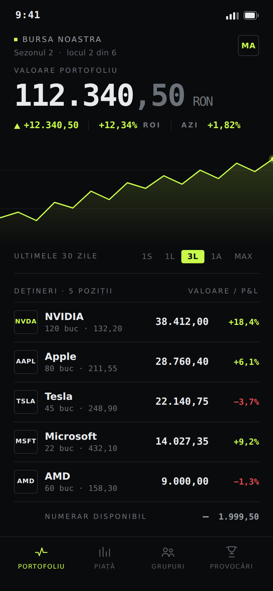
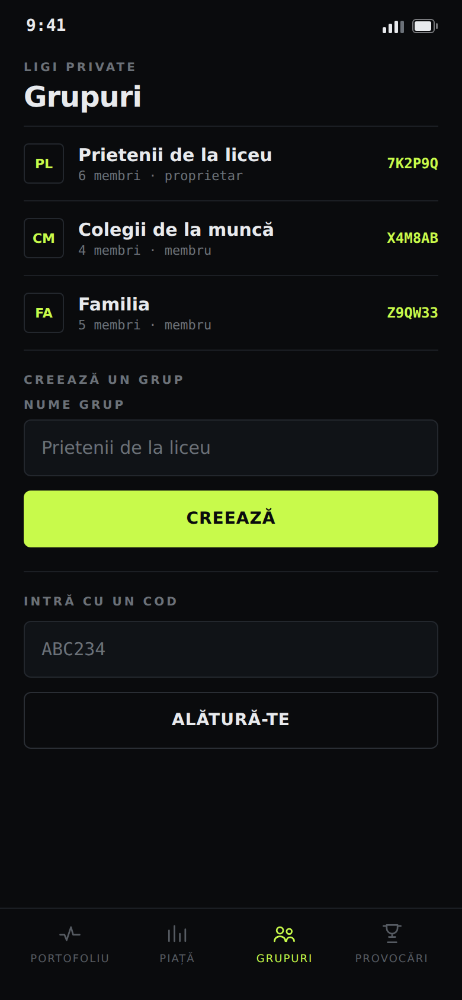
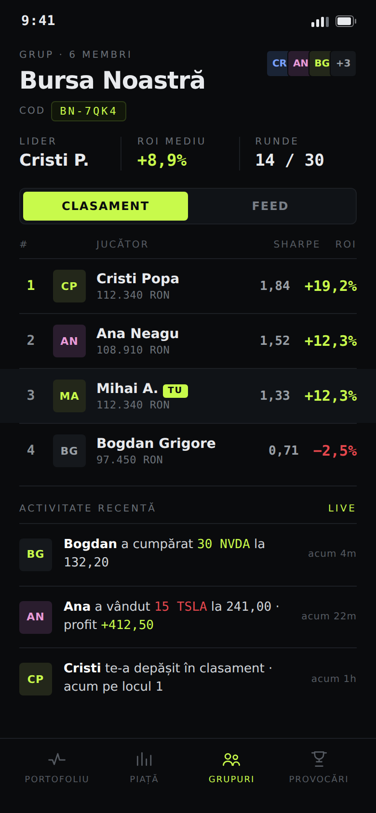
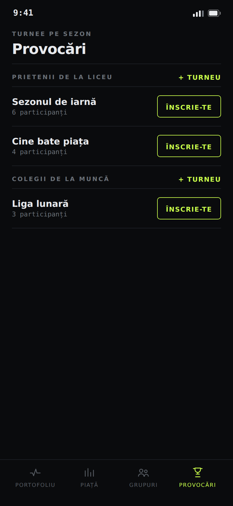

# Design — InvestPals (mobil)

Direcție vizuală: **„Terminal pro-trader"** — negru profund (#0A0B0D), un singur accent
**lime** (#C8FA4B), cifre **monospace tabulare**, etichete mici UPPERCASE cu tracking,
linii subțiri (hairlines) în loc de carduri-bule, iconițe SVG line-art. **Fără emoji.**
Câștigurile se afișează în lime, pierderile în roșu (#E5484D).

Paleta și componentele: `mobile/src/theme.ts`, `mobile/src/components/ui.tsx`,
`mobile/src/components/icons.tsx` (iconițe + grafic SVG).

## Ecrane

| | Ecran |
| --- | --- |
|  | **Login** — wordmark, OAuth Google/Apple |
|  | **Portofoliu** — equity mono, ROI lime, grafic, streak/credite, dețineri |
|  | **Piață** — instrumente live, modul de tranzacționare + Bullish/Bearish |
|  | **Grupuri** — ligi private cu cod de invitație |
|  | **Detaliu grup** — Clasament / Feed / Sentiment |
|  | **Provocări** — turnee pe sezon, per grup |

> Partea educativă (academie/quiz) a fost **scoasă**; al 4-lea tab e acum **Provocări**.
> Capturile sunt randate la 390×844 @2x (Playwright cu viewport forțat), reprezentând
> fidel designul implementat în cod.
