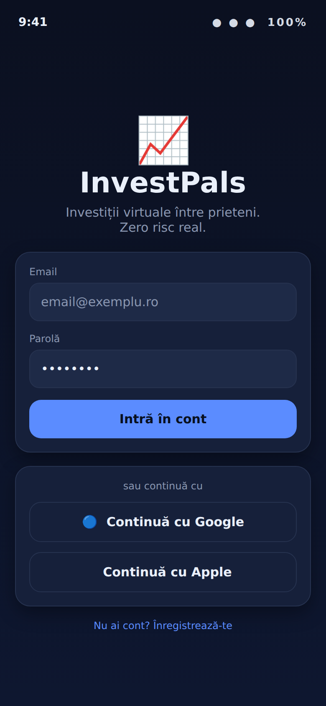
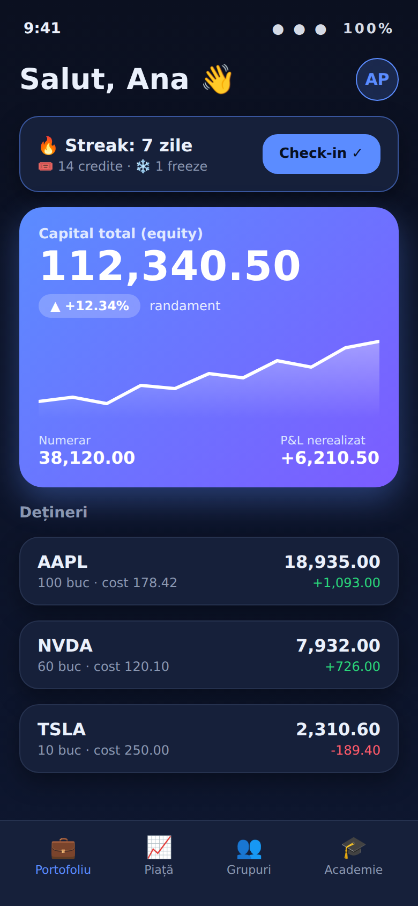
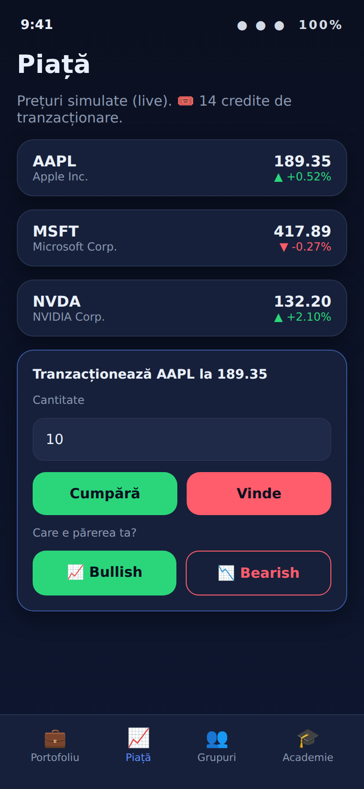
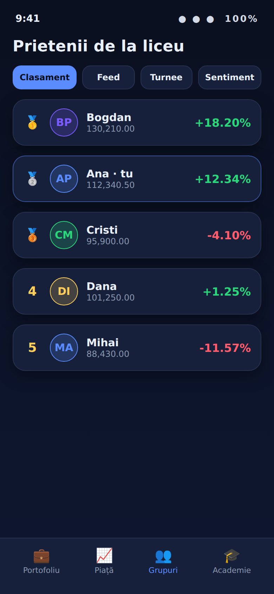
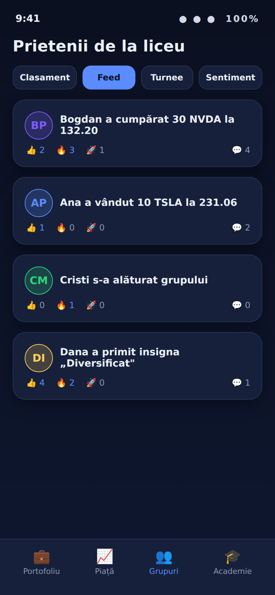
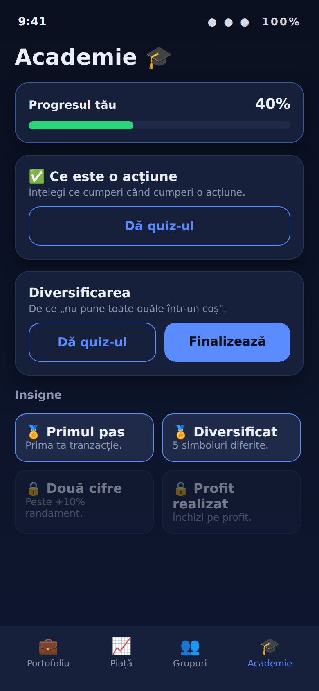

# Design — InvestPals (mobil)

Direcție vizuală: **dark-first, prietenoasă, modernă** — carduri rotunjite cu umbre,
un albastru-violet ca accent, verde/roșu pentru câștig/pierdere, avatare cu inițiale,
emoji ca accente, grafic de capital cu gradient.

Paleta și componentele sunt în `mobile/src/theme.ts` și `mobile/src/components/ui.tsx`.

## Ecrane (machete)

| | Ecran |
| --- | --- |
|  | **Login** — logo, OAuth Google/Apple |
|  | **Portofoliu** — card de streak 🔥, hero equity cu grafic, dețineri |
|  | **Piață** — instrumente live, panou de tranzacționare + sentiment 📈📉 |
|  | **Clasament de grup** — medalii 🥇🥈🥉, avatare, rândul „tu" evidențiat |
|  | **Feed social** — activitate, reacții, comentarii |
|  | **Academie** — progres, misiuni, quiz-uri, insigne |

## Cum se regenerează machetele
`mockups.gen.mjs` produce fișiere HTML; capturile se fac cu Chromium la viewport 390×844 @2x
(Playwright cu viewport forțat — altfel chenarul ferestrei taie bara de jos).

> Notă: machetele sunt o reprezentare fidelă a designului implementat în cod (aceeași paletă
> și aceleași componente). Nu sunt capturi din build-ul Expo rulat pe device.
